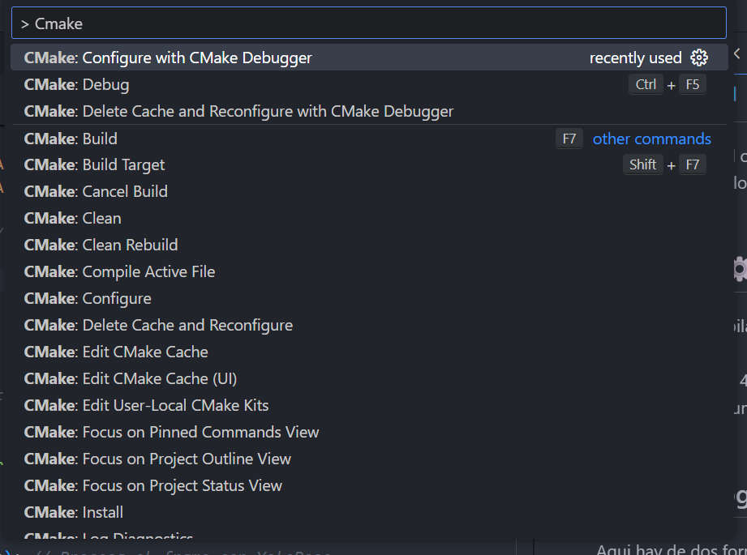

# People_distance_detection usando C++

<div style="text-align: center;">
  
</div>

Hola, se que estas leyendo esto porque tienes que leer esto para entender lo que hace mi codigo. El siguiente codigo hace CASI lo mismo que ```people_distance_detection.py```, solo que la diferencia es que pude combinar ambos modelos de deteccion de objetos junto al de detección de personas (GASTA RECURSOS COMO LOCO, POR ENDE ESTA DESACTIVADA ESTA ULTIMA FUNCIÓN) .

## Recursos 🖥️

<div style="text-align: center;">
  
</div>

En terminos de recursos, no tenemos recursos... El objetivo es que gaste los menos posibles para que funcione en una NVIDIA Jetson Xavier, por lo que si vas a editar este codigo, asegurate de que sea **lo mas optimo posible**.

## Requisitos ⚙️

- Algun compilador de C++ (MinGW/GCC)
- CMake
- OpenCV >= 4.7.0
- CUDA 12 (aunque no lo este usando en el momento, ve instalandolo)
- Fe 🙏


## Ejecutar programa 🚀

Aqui hay de dos formas, la tradicional seria en la que creas la carpeta ```build``` y corres el cmake desde la terminal:

### Tradicional
```
mkdir build && cd build
cmake ..
cmake ..build 
```

Luego buscas el .exe o .dll y lo corres.

### En VSCode

Si tienes instalado las extenciones de C++ en VSCode junto a CMake, con que guardes tu CMakeLists.txt en vscode automaticamente deberia de marcarte cual compilador quieres usar o en caso de que no aparezca nada, puedes usar las funcion de configurar con el Debugger


<div style="text-align: center;">
  
</div>


## TO-DO LIST 📋

- [X] Crear un CMakeLists.txt entendible y facil de manipular.
- [~] Hacer el CMakeLists adaptable para trabajar en cualquier computadora (WIN32/LINUX)
- [X] Crear el modelo .onnx (lee la docs de [ultralytics](https://github.com/ultralytics/ultralytics) para convertir el modelo mas reciente)
- [] Agregar las distancias con respecto a la camara.
- [] Agregar lo de Foxglove
- [X] Lograr correr dos modelos al mismo tiempo (real pain).
- [] Reescribir los nodos de ROS
- [] OPTIMIZAR EL CODIGO 🥲

## Creditos

Roberto Priego Bautista - [@rpribau](https://github.com/rpribau)